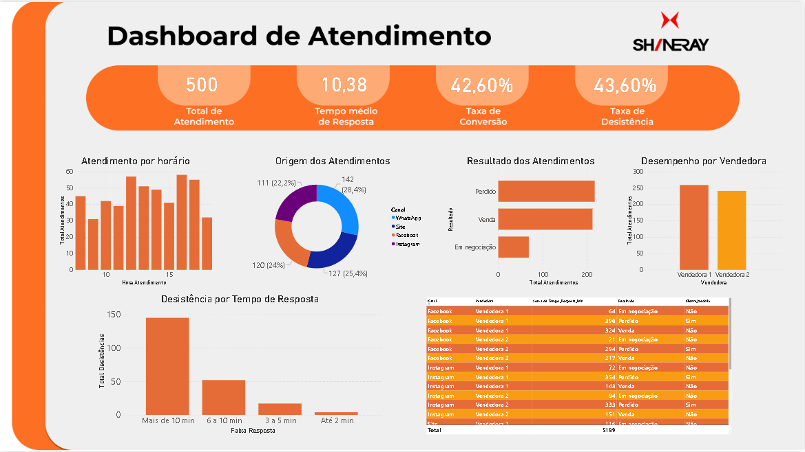

# Melhoria do Atendimento ao Cliente da Shineray

Projeto desenvolvido para a disciplina de Projeto Integrador II do curso de Análise e Desenvolvimento de Sistemas, com foco na análise de dados e otimização do processo de atendimento ao cliente da empresa Shineray Manaus.

---

# Integrantes

- LUIS GABRIEL BEZERRA DE SOUZA - TECNOLOGIA EM ANÁLISE E DESENVOLVIMENTO DE SISTEMAS
- WENDELL HENRIQUE ANJOS DA COSTA - TECNOLOGIA EM ANÁLISE E DESENVOLVIMENTO DE SISTEMAS
- WILLIANS JOSE OTERO MARTIN - TECNOLOGIA EM ANÁLISE E DESENVOLVIMENTO DE SISTEMAS

---

# Empresa Parceira

**Shineray Manaus**

📍 Av. Cosme Ferreira, 4006 - Coroado, Manaus - AM

**Responsável pelo acompanhamento do projeto:**
- Raul Gomes — Gerente Geral

---

# Objetivo

Analisar o processo de atendimento ao cliente da empresa Shineray, identificando gargalos, dificuldades e oportunidades de melhoria através da análise de dados e da utilização de ferramentas de Business Intelligence.

---

# Problema Identificado

Durante o levantamento realizado junto à empresa foram identificados os seguintes desafios:

- Acúmulo de mensagens nos canais digitais;
- Dificuldade de acompanhamento dos clientes;
- Possibilidade de perda de clientes devido ao tempo de resposta;
- Atendimento centralizado em apenas duas vendedoras;
- Ausência de indicadores de desempenho para monitoramento do atendimento.

---

# Processo Atual de Atendimento

1. Captação de clientes através de anúncios e tráfego pago (Meta Ads);
2. Direcionamento para o WhatsApp da empresa;
3. Distribuição dos atendimentos pelo CRM;
4. Atendimento realizado pelas vendedoras;
5. Avaliação de financiamento ou forma de pagamento;
6. Finalização da venda;
7. Entrega da motocicleta ao cliente.

---

# Indicadores Analisados

- Total de Atendimentos
- Tempo Médio de Resposta
- Taxa de Conversão
- Taxa de Desistência
- Atendimentos por Canal
- Atendimentos por Horário
- Desempenho das Vendedoras
- Relação entre Tempo de Resposta e Desistência

---

# Ferramentas Utilizadas

- Power BI
- Microsoft Excel
- GitHub
- CRM da Empresa
- Draw.io (Fluxograma BPMN)

---

# Dashboard

Foi desenvolvido um dashboard interativo no Power BI para monitoramento dos indicadores de atendimento da empresa, permitindo a análise de desempenho, identificação de gargalos e apoio à tomada de decisão.

### Indicadores implementados

- Total de Atendimentos
- Tempo Médio de Resposta
- Taxa de Conversão
- Taxa de Desistência
- Atendimentos por Canal
- Atendimentos por Horário
- Desempenho das Vendedoras
- Relação entre Tempo de Resposta e Desistência



---

# Principais Resultados

A análise dos dados permitiu identificar os seguintes pontos:

- Foram analisados 500 registros de atendimento.
- O tempo médio de resposta foi de aproximadamente 10 minutos.
- A taxa de conversão observada foi de 42,60%.
- A taxa de desistência observada foi de 43,60%.
- Os maiores índices de desistência ocorreram quando o tempo de resposta ultrapassou 10 minutos.
- O atendimento está concentrado em apenas duas vendedoras.
- A empresa não possui indicadores formais de desempenho para acompanhamento contínuo do atendimento.

---

# Propostas de Melhoria

Com base na análise realizada, foram propostas as seguintes melhorias:

- Implantação permanente do dashboard desenvolvido;
- Definição de metas para tempo máximo de resposta;
- Utilização dos indicadores para acompanhamento periódico do desempenho;
- Melhor aproveitamento do CRM para monitoramento dos clientes;
- Priorização de atendimentos nos horários de maior demanda;
- Padronização do acompanhamento dos clientes durante o processo de venda.

---

# 📂 Estrutura do Repositório

```text
📁 documentos
📁 dados
📁 dashboard
📁 evidencias
📁 imagens
📁 python
📄 README.md
```

---

# Ética e Privacidade

Os dados utilizados neste projeto são simulados e anonimizados, construídos com base nas informações levantadas junto à empresa parceira. Nenhuma informação sensível de clientes foi utilizada, respeitando os princípios da LGPD.

---

# Disciplina

Projeto Integrador II
Curso: Análise e Desenvolvimento de Sistemas
Centro Universitário La Salle Manaus

# Status do Projeto

| Etapa | Status |
|---------|---------|
| Definição da empresa parceira | ✅ Concluído |
| Levantamento de requisitos | ✅ Concluído |
| Diagnóstico organizacional | ✅ Concluído |
| Coleta e preparação dos dados | ✅ Concluído |
| Análise dos dados | ✅ Concluído |
| Desenvolvimento do Dashboard | ✅ Concluído |
| Proposição de melhorias | ✅ Concluído |
| Documentação do projeto | 🔄 Em andamento |
